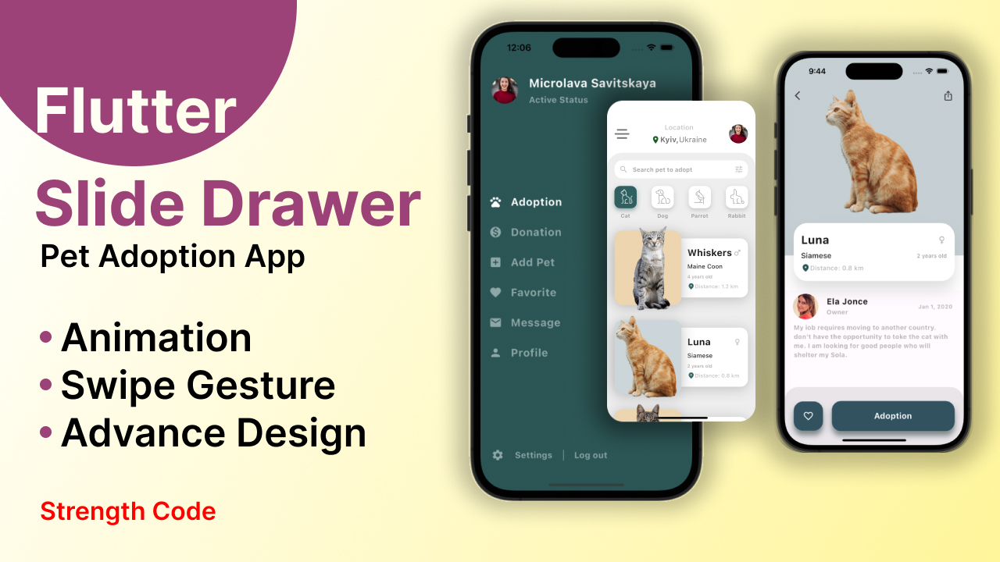

# Pet Adoption App with Gesture Control



Welcome to the repository for the Pet Adoption App with Gesture Control! This project demonstrates an innovative mobile app built using Flutter, featuring a unique gesture control sliding effect for seamless navigation.

## Overview

In this project, you will find the starter assets file and implementation details for creating a pet adoption app with two main screens: the Pet Listing Screen and the Pet Detail Screen. The app utilizes Flutter's animation techniques, GestureDetectors, and stack implementation to enhance the user experience.

## Key Features

- Gesture control sliding effect for intuitive navigation
- Pet Listing Screen with categorized pet listings
- Pet Detail Screen for in-depth information about individual pets
- Use of Flutter animations for a visually engaging experience

## Getting Started

To run the app locally, follow these steps:

1. Clone the repository:

   ```bash
   git clone https://github.com/shahbajjamil/silde_drawer.git

# [Watch it on YouTube <a href="https://twitter.com/JamilShahbaj"></a>](https://youtu.be/ArYGW2L_Kag)

# [Watch it on Instagram <a href="https://instagram.com/strength_code"></a>](https://instagram.com/strength_code)

## Project Created by
### Shahbaj Jamil
 #Flutter, #Android Developer, #ios.
 
<a href="https://www.instagram.com/shahbaj_jamil"></a>   <a href="https://www.facebook.com/shahbaj.jamil"></a>   <a href="https://twitter.com/JamilShahbaj"></a>   <a href="https://youtu.be/3_W5BW2aqCQ"></a>